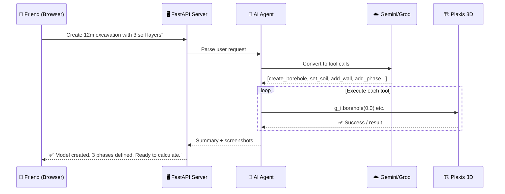

# Plaxis 3D AI Automation Agent

Build a self-contained, portable AI agent that automates Plaxis 3D V20 on your friend's laptop. You develop it here → zip it → friend runs it there.

## Architecture

```
plaxis-agent/                     ← This entire folder gets copied to friend's laptop
├── run.bat                       ← Double-click to start everything
├── setup.bat                     ← One-time: installs Python dependencies
├── .env                          ← API keys (Gemini + Groq)
├── requirements.txt              ← Python packages needed
│
├── app.py                        ← FastAPI server + WebSocket for dashboard
├── agent.py                      ← AI agent: NL → Plaxis command translation
├── plaxis_connection.py          ← Connection manager to Plaxis scripting server
│
├── tools/                        ← Plaxis tool functions the AI agent can call
│   ├── __init__.py
│   ├── geometry.py               ← Boreholes, surfaces, volumes, extrusion
│   ├── materials.py              ← Soil models (MC, HS, HSsmall, SS), structural materials
│   ├── structures.py             ← Plates, anchors, piles, interfaces, loads
│   ├── mesh.py                   ← Mesh generation, refinement, quality checks
│   ├── phases.py                 ← Calculation phases, staging, activation/deactivation
│   ├── calculate.py              ← Run calculations, monitor progress
│   ├── results.py                ← Extract displacements, forces, safety factors
│   └── project.py                ← New/open/save projects, undo, redo
│
├── providers/                    ← LLM providers (reused from your automation project)
│   ├── __init__.py
│   ├── base.py                   ← Base provider with cooldown logic
│   ├── gemini.py                 ← Gemini 2.0 Flash (primary)
│   └── groq.py                   ← Groq Llama 3.1 (failover)
│
├── templates/                    ← Pre-built analysis templates
│   ├── excavation.py             ← Deep excavation with retaining walls
│   ├── slope_stability.py        ← Slope with phi/c reduction
│   ├── foundation.py             ← Shallow/deep foundation bearing capacity
│   ├── embankment.py             ← Embankment on soft soil (consolidation)
│   └── tunnel.py                 ← Tunnel excavation with lining
│
└── dashboard/                    ← Web UI (single HTML file)
    └── index.html                ← Chat interface + live model viewer + results
```

## How It Works



## Proposed Changes

### Connection Manager
#### [NEW] [plaxis_connection.py](file:///c:/Users/souga/OneDrive/Desktop/plaxis-agent/plaxis_connection.py)
- Uses `plxscripting.easy.new_server()` to connect to Plaxis Input (port 10000) and Output (port 10001)
- Auto-reconnect on dropped connection
- Health check endpoint
- Stores `s_i`, `g_i`, `s_o`, `g_o` globals

---

### Plaxis Tools (AI-Callable Functions)

Each tool is a Python function with a docstring that the AI agent reads to understand what it does and what parameters it needs.

#### [NEW] [tools/geometry.py](file:///c:/Users/souga/OneDrive/Desktop/plaxis-agent/tools/geometry.py)
Functions:
- `create_borehole(x, y, layers)` — Create borehole with soil layer definitions
- `create_surface(points)` — Create 3D surface from point list
- `create_volume(points)` — Create soil volume
- `extrude(object, direction, length)` — Extrude 2D to 3D

#### [NEW] [tools/materials.py](file:///c:/Users/souga/OneDrive/Desktop/plaxis-agent/tools/materials.py)
Functions:
- `create_soil_material(name, model, params)` — Mohr-Coulomb, Hardening Soil, HS-small, Soft Soil
- `create_plate_material(name, params)` — For diaphragm walls, slabs
- `create_anchor_material(name, params)` — For ground anchors
- `assign_material(object, material)` — Assign material to geometry

#### [NEW] [tools/structures.py](file:///c:/Users/souga/OneDrive/Desktop/plaxis-agent/tools/structures.py)
Functions:
- `create_plate(points)` — Retaining walls, slabs, tunnel linings
- `create_anchor(point, direction, length)` — Ground anchors
- `create_pile(point, depth)` — Embedded piles
- `create_interface(object)` — Soil-structure interfaces
- `create_load(point_or_area, value, direction)` — Point/distributed loads

#### [NEW] [tools/mesh.py](file:///c:/Users/souga/OneDrive/Desktop/plaxis-agent/tools/mesh.py)
Functions:
- `generate_mesh(fineness)` — Very coarse to Very fine (0.0 to 1.0)
- `refine_mesh_around(object, factor)` — Local refinement
- `get_mesh_quality()` — Return element count and quality metrics

#### [NEW] [tools/phases.py](file:///c:/Users/souga/OneDrive/Desktop/plaxis-agent/tools/phases.py)
Functions:
- `add_phase(name, type)` — Initial, Plastic, Consolidation, Safety (phi/c reduction)
- `activate(phase, objects)` — Activate soil/structures in a phase
- `deactivate(phase, objects)` — Deactivate (excavation)
- `set_water_level(phase, level)` — Groundwater conditions
- `list_phases()` — Show all defined phases

#### [NEW] [tools/calculate.py](file:///c:/Users/souga/OneDrive/Desktop/plaxis-agent/tools/calculate.py)
Functions:
- `run_calculation()` — Execute all pending phases
- `get_calculation_status()` — Check progress and convergence
- `get_log()` — Return calculation log messages

#### [NEW] [tools/results.py](file:///c:/Users/souga/OneDrive/Desktop/plaxis-agent/tools/results.py)
Functions:
- `get_displacements(phase, point)` — Ux, Uy, Uz at a point
- `get_stresses(phase, point)` — σxx, σyy, σzz, τxy
- `get_structural_forces(phase, structure)` — N, M, V for plates/piles
- `get_safety_factor(phase)` — ΣMsf from phi/c reduction
- `export_results_to_excel(phase, output_path)` — Export to .xlsx

#### [NEW] [tools/project.py](file:///c:/Users/souga/OneDrive/Desktop/plaxis-agent/tools/project.py)
Functions:
- `new_project()` — Create blank project
- `open_project(path)` — Open existing .p3d file
- `save_project(path)` — Save current project
- `close_project()` — Close without saving

---

### AI Agent
#### [NEW] [agent.py](file:///c:/Users/souga/OneDrive/Desktop/plaxis-agent/agent.py)
- System prompt with all tool descriptions (function names, parameters, docstrings)
- Sends user message + tool descriptions to Gemini/Groq
- Parses LLM response for tool calls (JSON format)
- Executes tool calls sequentially against Plaxis
- Returns results to user
- Maintains conversation history for multi-turn context
- Falls back from Gemini → Groq on rate limit

---

### LLM Providers (Reused Pattern)
#### [NEW] [providers/](file:///c:/Users/souga/OneDrive/Desktop/plaxis-agent/providers/)
- Copied from your existing `automation/core/providers/` with the same failover pattern
- Only Gemini and Groq (as requested)
- Same base class with cooldown logic

---

### Web Dashboard
#### [NEW] [dashboard/index.html](file:///c:/Users/souga/OneDrive/Desktop/plaxis-agent/dashboard/index.html)
- **Chat panel** — Type natural language commands, see AI responses
- **Status panel** — Plaxis connection status, current project name, phase list
- **Results panel** — Display extracted values, safety factors, displacement plots
- **Quick actions** — Buttons for common operations (New Project, Calculate, Export)
- **Template launcher** — One-click to start excavation/slope/foundation analysis
- Dark theme, modern glassmorphic UI
- WebSocket connection for real-time updates

---

### Server
#### [NEW] [app.py](file:///c:/Users/souga/OneDrive/Desktop/plaxis-agent/app.py)
- FastAPI with WebSocket endpoint for chat
- REST endpoints for status, templates, results
- Serves the dashboard HTML
- Manages Plaxis connection lifecycle

---

### Setup & Launch Scripts
#### [NEW] [setup.bat](file:///c:/Users/souga/OneDrive/Desktop/plaxis-agent/setup.bat)
```batch
@echo off
echo Installing Plaxis Agent dependencies...
pip install plxscripting fastapi uvicorn websockets httpx google-genai python-dotenv openpyxl
echo Done! Now run: run.bat
pause
```

#### [NEW] [run.bat](file:///c:/Users/souga/OneDrive/Desktop/plaxis-agent/run.bat)
```batch
@echo off
echo Starting Plaxis AI Agent...
echo Make sure Plaxis 3D is open with scripting server enabled!
echo Dashboard will open at http://localhost:8501
python app.py
pause
```

## User Review Required

> [!IMPORTANT]
> **Friend's laptop setup** — Your friend needs to do these ONE-TIME steps:
> 1. Open Plaxis 3D → Expert → Configure remote scripting server → Enable on port 10000
> 2. Run `setup.bat` (installs Python packages)
> 3. Edit `.env` with your Gemini/Groq API keys
> 
> After that, it's just: Open Plaxis → double-click `run.bat` → use the browser dashboard.

> [!WARNING]
> **Plaxis license** — The scripting server requires an active Plaxis license. If your friend's license is node-locked, it only works on that specific laptop.

## Open Questions

> [!IMPORTANT]
> 1. **Does your friend have Python installed on their laptop?** If not, I'll bundle a portable Python or add installation instructions to `setup.bat`.
> 2. **Does your friend's Plaxis V20 have the scripting server?** (It should — it's included from V20 onwards, but some educational licenses restrict it.)
> 3. **Should the dashboard be password-protected?** Since it runs locally, it's not strictly needed, but good practice if the laptop is shared.

## Verification Plan

### On Your PC (Development)
- All Python files pass syntax checks
- LLM provider failover works with your API keys
- Dashboard loads correctly in browser
- Tool functions have correct Plaxis API signatures

### On Friend's Laptop (Deployment)
- `setup.bat` installs all dependencies
- `run.bat` starts the server
- Dashboard connects via WebSocket
- Plaxis connection establishes successfully
- A simple test: "Create a borehole at (0,0) with 2 soil layers" executes correctly
