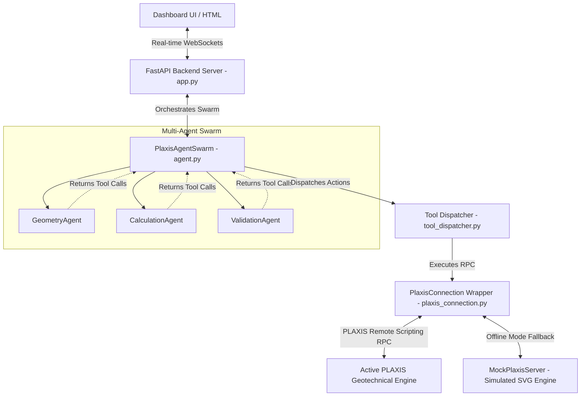

# PlaxisAI Codebase Architecture & System Map

> [!NOTE]
> This document serves as a high-fidelity architectural map and core-concept guide. It is optimized for both human developers and AI developer agents (such as code-indexing LLMs or Graphify) to instantly understand the system's abstractions, data flows, and extension patterns.

---

## 1. System Architecture Map (Swarm Orchestration)

The PlaxisAI platform runs on a **FastAPI backend** paired with a **WebSocket-enabled split-screen dashboard**. It coordinates a multi-agent optimization swarm to build, calculate, and self-correct finite element models in PLAXIS 2D/3D.

---

## 2. Core Concepts & Entities

### A. The PlaxisAgentSwarm (`agent.py`)
*   **Abstractions**: Manages three distinct, specialized sub-agents to divide-and-conquer complex engineering workflows:
    1.  `GeometryAgent`: Parses natural language commands into coordinates, layers, structural boundaries, piles, and plates.
    2.  `CalculationAgent`: Handles mesh generation, phase activation, calculations, and loading constraints.
    3.  `ValidationAgent`: Interrogates results (extracts Safety Factors, structural deformations) and evaluates design safety margins.
*   **Feedback Loop**: Runs up to `max_cycles = 2`. If `ValidationAgent` returns a Safety Factor ($FoS$) below the geotechnical target ($1.25$), it passes the failure feedback back to the `GeometryAgent` to automatically adjust parameters (e.g. increase wall thickness, add anchors) and recalculate.

### B. PlaxisConnection Wrapper (`plaxis_connection.py`)
*   **Abstractions**: A thread-safe Singleton (`PlaxisConnection`) that handles remote scripting RPC connections via the official `plxscripting` library on ports `10000` (Input) and `10001` (Output).
*   **Resilience Layer**: If the PLAXIS server is not running or `plxscripting` is missing, it auto-falls back to **Simulation Mode** (`MockPlaxisServer`). This allows local testing and full demo execution offline.

### C. Local AI Integration (`providers/ollama_provider.py`)
*   **Abstractions**: Implements the `LLMProvider` interface to talk natively to local **Ollama** servers running `gemma:2b` or larger models at `http://localhost:11434`.
*   **Zero-Dependency**: Uses standard HTTP chunked requests (`httpx`) to support model pulling, installation progress tracking, and secure offline execution without heavy external dependencies.

---

## 3. Communication Protocols

| Endpoint / Channel | Protocol | Payload Type | Description |
| :--- | :--- | :--- | :--- |
| `/ws` | WebSocket | JSON | Handles bidirectional live chat messages, websocket status synchronization, and model screenshot triggers. |
| `/api/ollama/status` | HTTP GET | JSON | Queries whether Ollama is installed, active, and contains the `gemma:2b` model. |
| `/api/ollama/install` | HTTP POST | JSON | Silently downloads `OllamaSetup.exe` to a temp directory and spawns the UAC installer process. |
| `/api/ollama/pull` | HTTP POST | Event-Stream (SSE) | Streams live progress percentages for the Gemma 2B model download to the client dashboard. |

---

## 4. How to Extend This Codebase

### Adding a New Tool / Geotechnical Command
1.  **Define the python function** in `tools/` (or inside the dispatcher).
2.  **Register the command** in `tool_dispatcher.py` inside the `dispatch_tool_calls` function.
3.  **Update Agent System Prompts** in `agent.py` under the appropriate agent class (`GeometryAgent`, `CalculationAgent`, etc.) so the LLM understands when and how to call the new tool.

### Adding a New LLM Provider
1.  **Create a new file** in `providers/your_provider.py` implementing `LLMProvider`.
2.  **Register your class** inside `providers/__init__.py`.
3.  **Add initializer logic** in `PlaxisAgentSwarm._init_providers` in `agent.py`.
